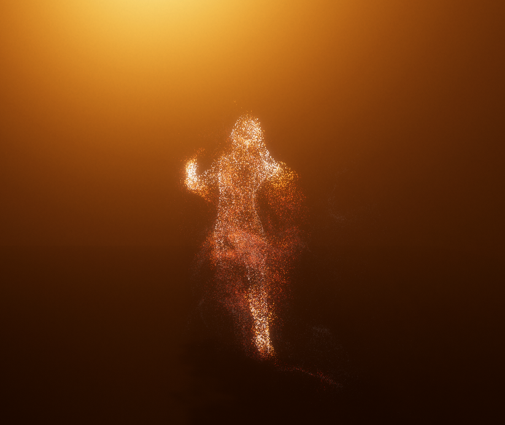
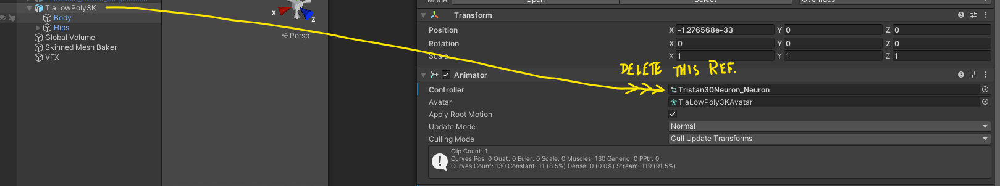
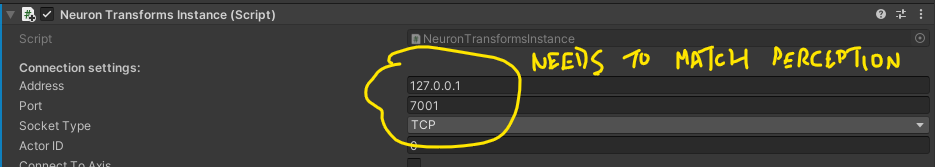

# Perception Neuron + Visual Effects Graph

## Authors
George Adamopoulos

## How To
The project plays back a pre-recorded animation by default. To switch to real-time mocap mode, you need to delete the AnimatorController reference from Animator component on the model, and make sure that the networking parameters are the same as those set-up on the Perception Neuron software settings.

